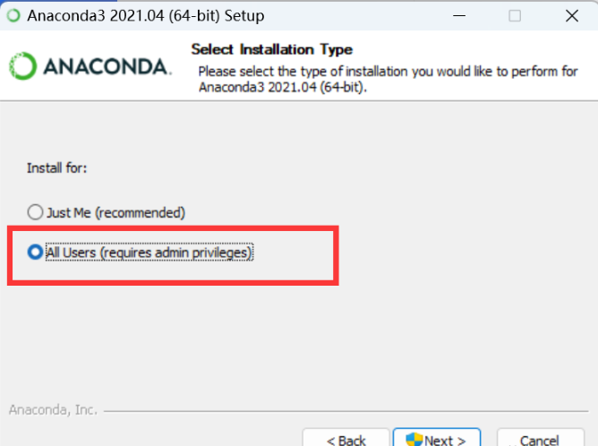

****

**通过这篇博文，教你手把手配置好一套方便常用的机器学习/深度学习环境（附CUDA+PyTorch-gpu版配置方法）**

<!--more-->

<br />

## **一、引言**

近年来，机器学习（Machine Learning）的研究越来越火热，机器学习是一种人工智能（AI）领域的分支，它致力于让计算机系统通过从数据中学习并提高性能，而不是通过明确编程来执行特定任务。机器学习的主要目标是让计算机系统能够自动识别和理解数据中的模式，从而能够做出预测、分类、聚类等各种决策和任务。

Anaconda 是一个用于数据科学和机器学习的开源发行版和包管理工具。它包含了许多用于数据分析、科学计算和机器学习的常用工具和库，例如Python编程语言、Jupyter Notebook、NumPy、pandas、scikit-learn等等。Anaconda 的优点包括：

1. 管理便捷：Anaconda 提供了一个方便的环境管理工具，可以轻松创建、管理和切换不同的Python环境，以满足不同项目的需求。
2. 预安装包：Anaconda 预装了大量数据科学和机器学习库，减少了配置环境的麻烦，使用户更容易入门。
3. 跨平台：Anaconda 支持多个操作系统，包括Windows、Linux和macOS。

PyTorch 是一个深度学习框架，用于构建和训练神经网络模型。它的优点包括：

1. 动态计算图：PyTorch 使用动态计算图，这意味着计算图是根据代码的执行而构建的，使得模型的定义和调试更加直观和灵活。
2. Pythonic：PyTorch 的接口与Python语言紧密集成，因此它更容易学习和使用，尤其对于熟悉Python的开发者来说。
3. 强大的社区支持：PyTorch 有一个活跃的社区，提供了大量的文档、教程和扩展库，帮助用户更轻松地开发和训练深度学习模型。
4. 部署和生产：PyTorch 提供了用于模型部署的工具，如TorchScript，使得将训练好的模型部署到生产环境更容易。

Anaconda 是一个数据科学和机器学习的综合工具包，而PyTorch 是一个深度学习框架，它们可以一起使用，帮助数据科学家和机器学习工程师更轻松地开发、训练和部署机器学习模型。下面笔者将介绍如何配置Anaconda+Pytorch的一套机器学习训练环境。

<br />

## **二、安装Anaconda**

配置环境的第一步，当然就是安装Anaconda软件。

点击进入官网[安装Anaconda](https://www.anaconda.com/download/)。如果下载不稳定，也可以进入[清华大学开源软件镜像站](https://mirrors.tuna.tsinghua.edu.cn/anaconda/archive/?C=M&O=D)下载。

下载安装包后，双击打开，next；选择All Users



下一步选择安装路径，如果C盘空间不充裕请改换到其他硬盘。

下一步，去掉第一个框框的勾选。第一项意思是将安装路径填入到系统环境变量中，勾选的话后面使用会出现问题，还是不要选（觉得手动配置有难度的当然也可以直接勾选第一个，自动配置）。


等待安装结束后（安装页面出现Installation Complete），配置环境变量。

桌面右键此电脑—>属性—>高级系统设置—>环境变量—>双击path—>新建；或者直接按win键，搜索“环境变量”。


把这几条复制到里面（注意下面写的是默认安装路径的指令，你需要根据自己实际安装目录进行改动）。

```
C:\ProgramData\Anaconda3
C:\ProgramData\Anaconda3\Scripts 
C:\ProgramData\Anaconda3\Library\mingw-w64\bin
C:\ProgramData\Anaconda3\Library\usr\bin 
C:\ProgramData\Anaconda3\Library\bin
```

确定保存就可以。

下面来验证一下Anaconda是否安装成功。Win+R，输入cmd后确定（或者直接在“开始”中搜索cmd），进入命令提示符终端，输入：

```powershell
conda --version
```

如果出现下图的提示说明安装成功。


此外，Windows“开始”页面——所有应用——Anaconda3的文件夹中会添加相应快捷方式。其中，Anaconda Navigator是anaconda菜单配置页面，可以理解为“主页”。


<br />

## **三、新建PyTorch虚拟环境**

### 3.1  配置清华源

由于conda指令服务器在境外，所以国内获取资源会比较缓慢，配置清华大学镜像下载源，可以打开Anaconda Prompt。（Prompt会经常使用，所以可以把它的快捷方式固定到“开始”页面中，或发送到桌面快捷方式）


依次键入以下代码以配置清华源。

```powershell
conda config --add channels https://mirrors.tuna.tsinghua.edu.cn/anaconda/pkgs/free/
conda config --add channels https://mirrors.tuna.tsinghua.edu.cn/anaconda/pkgs/main/
conda config --add channels https://mirrors.tuna.tsinghua.edu.cn/anaconda/cloud/pytorch/
conda config --add channels https://mirrors.tuna.tsinghua.edu.cn/anaconda/cloud/pytorch/linux-64/
conda config --set show_channel_urls yes
```

<br />

### 3.2  创建并激活PyTorch环境

在Prompt中继续键入以下代码，创建名为pytorch的环境。

```powershell
conda create -n pytorch python=3.9
```

当然，也可以自定义环境的名字和python版本，按照以下格式自行修改。

```powershell
conda create -n 环境名称 python=x.x
```

查看环境是否创建成功。

```powershell
conda env list
```

如图，如果列表中出现了pytorch，则代表环境已成功创建。


此时，Anaconda Navigator页面左侧Environment列表里也会出现pytorch列表。


创建好环境后，使用下面这条命令激活pytorch环境。

```powershell
conda activate pytorch
```

激活成功后，代码左侧括号中的（base）将变为（pytorch）。完成此步之后，才可继续进行下一步安装pytorch。

<br />

## **四、配置PyTorch虚拟环境——CPU版**

*有独立显卡的建议转至第五章安装GPU版

进入[PyTorch官网](https://pytorch.org/get-started/locally/)。

如下图，根据需要在第二栏选择操作系统，第三栏选择Conda，第五栏选择CPU，复制指令到激活pytorch后的Prompt页面并运行。


图中默认的安装指令：

```powershell
conda install pytorch torchvision torchaudio cpuonly -c pytorch
```

安装的过程中若弹出提示[y/N]?  键入y后回车即可，等待安装完成。

<br />

## **五、配置PyTorch虚拟环境——GPU版**

### 5.1  下载CUDA和cuDNN（仅限Nvidia独立显卡）

首先在桌面右键打开终端，或Win+R，输入cmd后回车后、打开Windows终端控制。输入以下命令查看当前驱动版本号。

```powershell
nvidia-smi
```

红色框部分即为对应驱动版本，右侧是最高可以支持的CUDA版本号。 


点击[此链接](https://docs.nvidia.com/cuda/cuda-toolkit-release-notes/index.html)查看CUDA版本对应的最低GPU驱动版本关系，或者直接参考下图。


目前比较广泛使用的是11.5-11.8版本，不建议安装最新的12.2，因为有些环境还没有完全适配。博主是RTX 3060，驱动版本537.13，安装了CUDA 12.1，以供参考。

在确定好CUDA版本后，在[CUDA Toolkit Archive](https://developer.nvidia.com/cuda-toolkit-archive)中下载对应版本的CUDA工具包。点进去之后根据自己实际情况，依次选择操作系统—>架构—>系统版本—>本地安装 exe (loacl)(别选错这个)—>下载。

下载CUDA后，进入[cuDNN Archive](https://developer.nvidia.com/rdp/cudnn-archive)下载与CUDA版本对应的cuDNN。

### 5.2  安装CUDA

下载完CUDA和cuDNN后，分别进行安装。

首先安装CUDA，安装选自定义安装，点击下一步。


展开CUDA。*如果你前面没有安装Visual Studio，需要把CUDA里面的Visual Studio Integration取消勾选，否则会安装不成功。


下一步是选择安装的位置了，可以直接默认安装在C盘，也可以自定义，但是一定要记住安装的位置，后面需要用到。


之后一直下一步，等待安装完成。

<br />

### 5.3  安装cuDNN

将下载的cuDNN压缩包解压缩，会得到3个文件夹：bin、include和lib。

回到刚才需要记住的那个CUDA的安装目录。默认为C:\Program Files\NVIDIA GPU Computing Toolkit\CUDA\v11.6。（最后的版本以自己安装的CUDA实际版本为准，后同）

把cuDNN压缩包解压缩，分别把cuDNN解压出的bin、include、lib\x64三个文件夹中的.dll、.h和.lib文件复制到CUDA目录下对应文件夹里。（注意是.dll、.h和.lib文件，不是直接覆盖3个文件夹目录）。


<br />

### 5.4  环境变量配置

如第二章所述，桌面右键此电脑—>属性—>高级系统设置—>环境变量；懒得话直接按win键，搜索“环境变量”。

可以看到系统中多了CUDA_PATH和CUDA_PATH_V10_1两个环境变量。如下图，在系统中添加以下几个环境变量：

```powershell
变量名：CUDA_LIB_PATH  变量值：%CUDA_PATH%\lib\x64
变量名：CUDA_BIN_PATH  变量值：%CUDA_PATH%\bin
变量名：CUDA_SDK_PATH  变量值：C:\ProgramData\NVIDIA Corporation\CUDA Samples\v11.6
变量名：CUDA_SDK_LIB_PATH  变量值：%CUDA_SDK_PATH%\bin\win64
变量名：CUDA_SDK_BIN_PATH  变量值：%CUDA_SDK_PATH%\common\lib\x64
```

（\*注① ProgramData是隐藏文件，设置下才能看到；\*注② 如果是CUDA 12.0及以上版本，可能不存在CUDA_SDK_PATH，那么后面3条都不需要配置）


添加完后如图所示：


下一步，在系统变量 **PATH** 里面添加（版本xx.x按照实际情况修改；同理，CUDA 12.0及以上第3、4和最后两条不需要配置）：

```powershell
%CUDA_LIB_PATH%
%CUDA_BIN_PATH%
%CUDA_SDK_LIB_PATH%
%CUDA_SDK_BIN_PATH%
C:\Program Files\NVIDIA GPU Computing Toolkit\CUDA\v11.6\lib\x64
C:\Program Files\NVIDIA GPU Computing Toolkit\CUDA\v11.6\bin
C:\ProgramData\NVIDIA Corporation\CUDA Samples\v11.6\common\lib\x64
C:\ProgramData\NVIDIA Corporation\CUDA Samples\v11.6\bin\win64
```


最后验证CUDA+cuDNN是否成功安装。Win+R打开cmd，输入nvcc -V（中间有空格，V要大写），出现了你安装的CUDA的版本信息，说明安装成功了。


### 5.5  安装Pytorch-gpu版

打开Anaconda Prompt，输入下面这条命令激活pytorch环境。

```powershell
conda activate pytorch
```

激活成功后，代码左侧括号中的（base）将变为（pytorch）。完成此步之后，才可继续进行下一步安装pytorch。

进入[PyTorch官网](https://pytorch.org/get-started/locally/)。

如下图，根据需要在第二栏选择操作系统，第三栏选择Conda，第五栏选择对应的CUDA版本（如果是CUDA12.1及以上则第一栏选择Preview）。这里选择了CUDA 11.8，复制指令到激活pytorch后的Prompt页面并运行。


图中默认的安装指令：

```
conda install pytorch torchvision torchaudio pytorch-cuda=11.8 -c pytorch -c nvidia
```

安装的过程中若弹出提示[y/N]?  键入y后回车即可，等待安装完成。

最后验证PyTorch-gpu + CUDA环境是否安装成功。

打开Anaconda Prompt，依次输入以下命令。

```python
activate pytorch
python
import torch
torch.__version__
torch.cuda.is_available()
torch.cuda.get_device_name(0) 
```

如下图，如果出现了正确的PyTorch版本，True和正确的显卡版本，则说明pytorch-gpu版安装完成并可成功使用。


<br />

## **六、安装Spyder**

如本文第二章所示，打开Anaconda Navigator，进入Home主页，找到Spyder，点击下面的“Install”。（我已经安装过了所以显示的是Launch）


安装完后可以从Navigator或开始页面打开，也可以将快捷方式发送到桌面上。


<br />

## **七、结论**

尽管笔者已经尽量较为全面地体现安装的过程，但是难免有疏忽遗漏，请多多包涵。如果安装配置过程中出现任何疑问，可以执行查询搜索关键字以解决，大部分问题都是缺少包或者版本不对应，通过在Anaconda Prompt中conda uninstall和conda install能够解决。

Anaconda是个集大成的环境配置软件，其中配置的虚拟环境（如本文中的pytorch虚拟环境）都能直接在各种平台上应用，如spyder、PyCharm和Jupyter Notebook等，而且配置不同的环境，有时候往往只需要一个pip或conda指令就能解决，希望能给相关兴趣者或学者提供一些思路。

下一篇文章，笔者将介绍一个在深度学习领域一个非常经典的实例——手写数字识别的训练和测试，在本文配置好的Spyder+PyTorch-GPU上运行。

<br />

*有疑问请联系笔者 lizhq@mail.ustc.edu.cn，转发引用请标注原作者及来源。

<br />

## Reference

[1] [Anaconda超详细安装教程（Windows环境下）_conda安装_菜鸟1号！！的博客-CSDN博客](https://blog.csdn.net/fan18317517352/article/details/123035625)

[2] [pytorch gpu版本的最全安装教程，含环境配置、CUDA（百度云下载）安装程序失败解决方案_cuda version: 10.2 python 3.6下载pytorch版本_识久的博客-CSDN博客](https://blog.csdn.net/L1778586311/article/details/112425993)

[3] [CUDA安装及环境配置——最新详细版_cuda环境配置_abbrave的博客-CSDN博客](https://blog.csdn.net/chen565884393/article/details/127905428)

[4] [Spyder安装与环境配置_spyder环境配置_Pavements的博客-CSDN博客](https://blog.csdn.net/yangtzech/article/details/118500728)
